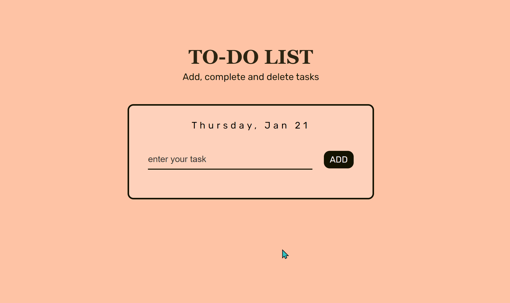

### General info

To-do list app made using vanilla JavaScript.

#### Features

- User can add, complete & delete tasks
- View the current date (day, month, date)
- Use the ENTER key to add tasks
- User cannot add task if the input field is empty; window will display an alert pop-up box

### To view

Link to project: https://juel07.github.io/to-do-list/

### Demo

### Technologies

- HTML
- CSS
- JavaScript
